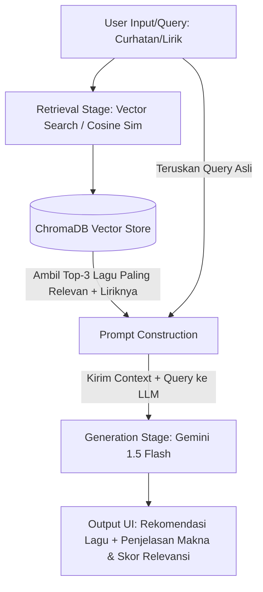

# Ketentuan Proyek Mata Kuliah Temu Kembali Informasi (TKI)

Dokumen ini berisi persyaratan resmi proyek akhir mata kuliah Temu Kembali Informasi (Information Retrieval) yang harus dipenuhi oleh sistem.

---

## 1. Kriteria Sistem
* **Jenis Aplikasi**: Dapat berupa Web-Based Application, Desktop Application, Command Line Interface (CLI), atau Dashboard.
* **Fitur Minimal**:
  * Pencarian lirik/lagu.
  * Hasil pencarian berupa daftar informasi terkait.
  * **Skor Relevansi** (menampilkan seberapa mirip hasil pencarian dengan query secara matematis).
* **Alur Wajib**:
  1. Menerima query dari pengguna.
  2. Melakukan preprocessing teks pada query.
  3. Melakukan indexing dokumen.
  4. Menghitung nilai relevansi dokumen.
  5. Menampilkan ranking hasil pencarian berdasarkan skor tertinggi.
  6. **Melakukan evaluasi performa sistem** (menghitung metrik akurasi).

---

## 2. Tema & Dataset
* **Tema**: Bebas/spesifik (kelompok kami memilih **STKI Lirik Lagu**).
* **Bentuk Data**: Dataset teks di mana setiap dokumen memuat **minimal 100 kata** atau informasi tekstual yang memadai untuk proses temu kembali informasi.
* **Sumber Data**: Diperoleh dari Kaggle (`spotify_dataset.csv`).

---

## 3. Preprocessing Teks
* **Tujuan**: Mengolah data lirik mentah menjadi representasi bersih yang siap diindeks.
* **Metode yang Diterapkan**:
  * *Case Folding* (mengubah ke huruf kecil).
  * *Regex Cleaning* (menghapus tag instrumen/struktur lagu seperti `[Chorus]`, `[Verse]`, dll.).
  * *Trimming/Padding* (membatasi teks lirik panjang agar efisien untuk model).

---

## 4. Model IR (Information Retrieval) & Arsitektur RAG
* **Model**: Menggunakan **Dense Vector Space Model (VSM)** dengan arsitektur **Transformer (Sentence-BERT)**.
* **Pencarian Relevansi**: Menggunakan **Cosine Similarity** untuk menghitung kedekatan sudut antar vektor dokumen dan vektor kueri.
* **Evaluasi**: Model harus dapat diukur performanya secara matematis.

### Arsitektur Alur Kerja RAG Lirik Lagu:

---

## 5. Evaluasi Sistem
* **Metrik Evaluasi**: Menggunakan metrik evaluasi TKI standar seperti **Precision@K** (misal Precision@1, Precision@2), **Recall**, dan **MAP (Mean Average Precision)**.
* **Skenario Uji**: 
  * Wajib memuat perbandingan kueri uji dengan jawaban yang benar (*Ground Truth*).
  * Menggunakan **minimal 10 kueri pengujian** dengan konteks/kasus yang berbeda untuk mengukur keandalan sistem.
